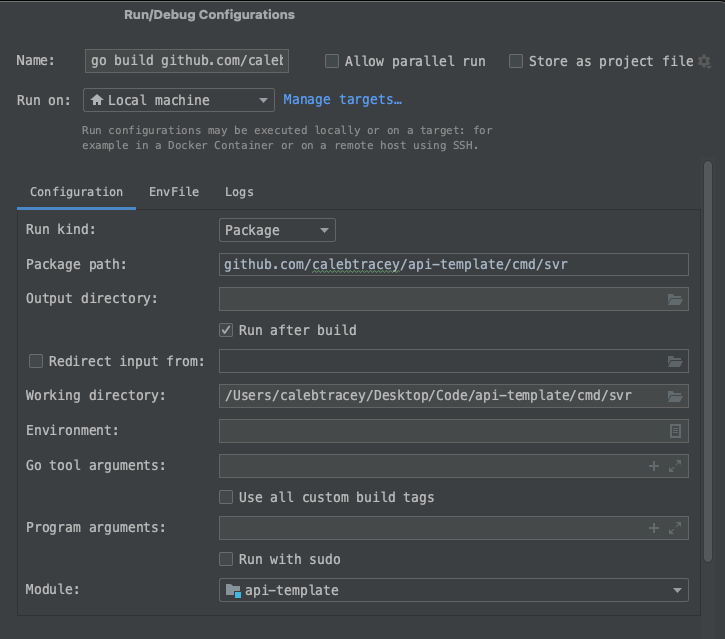

# api-template

### Go REST API template

This template uses a DAO/Facade pattern. The internal package contains basic example setups for each layer.

---

**Includes the following:**
- OpenAPI 3.0 documentation
- GitHub Workflows for Test/Build phases
- Preset Docker + docker-compose files

**Basic setup**
1. Create a local Postgres database and update the config.yaml file with the details
2. Update go.mod and file imports with your repo name
3. Run the following commands to update dependencies:

   `go get -u ./...`

    `go mod tidy`
4. Make a run configuration as seen below with your repo name:

#### Now you can start the API and access http://localhost:6080/swagger-ui/ for swagger documentation and testing